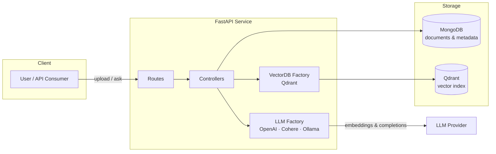
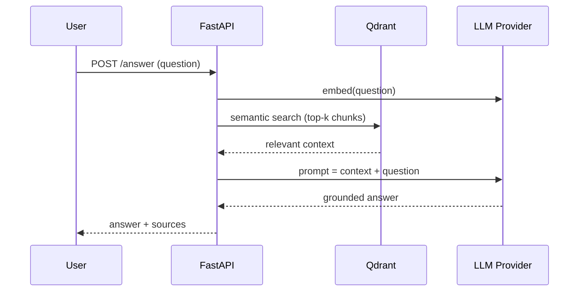

# mini-RAG — Document Q&A with Retrieval-Augmented Generation

A production-style **Retrieval-Augmented Generation (RAG)** service built with **FastAPI**. Upload your own documents, and the system chunks, embeds, and indexes them in a vector database — then answers natural-language questions grounded in *your* data instead of the LLM's memory.


---

## Why this project

LLMs hallucinate when asked about private or domain-specific documents. This service solves that by retrieving the most relevant chunks of the user's own files at query time and letting the LLM answer **only from that context** — the core pattern behind modern enterprise AI assistants.

## Key Features

- **End-to-end RAG pipeline** — file upload → chunking → embedding → vector indexing → semantic search → augmented answer
- **Provider-agnostic LLM factory** — swap **OpenAI**, **Cohere**, or a local **Ollama** server through configuration, not code changes
- **Pluggable vector store** — Qdrant today; the factory pattern keeps other vector DBs one adapter away
- **Async document & metadata store** — MongoDB with Motor for non-blocking I/O
- **Project-scoped collections** — multiple document sets isolated per project ID
- **Dockerized infrastructure** — one `docker compose up` for the full stack

## Architecture



### Query flow



## Project Structure

```
src/
├── main.py           # FastAPI entrypoint
├── routes/           # API endpoints (upload, process, search, answer)
├── controllers/      # Business logic for each pipeline stage
├── models/           # MongoDB schemes & data models
├── stores/
│   ├── llm/          # LLM provider factory (OpenAI / Cohere / Ollama)
│   └── vectordb/     # Vector store factory (Qdrant)
├── helpers/          # Config & utilities
└── assets/           # Uploaded files & artifacts
docker/               # docker-compose (MongoDB, services)
```

## Getting Started

### 1. Requirements
- Python **3.8+** (Miniconda recommended)
- Docker & Docker Compose

### 2. Environment

```bash
conda create -n mini-rag python=3.8 && conda activate mini-rag
pip install -r src/requirements.txt

cp src/.env.example src/.env        # set OPENAI_API_KEY / COHERE_API_KEY, DB settings
cp docker/.env.example docker/.env  # set MongoDB credentials
```

### 3. Run infrastructure

```bash
cd docker
docker compose up -d
```

### 4. Run the API

```bash
cd src
uvicorn main:app --reload --host 0.0.0.0 --port 5000
```

Interactive API docs: `http://localhost:5000/docs`

### Optional: local LLM via Ollama
The LLM factory supports pointing `GENERATION_BACKEND` at an Ollama server, so the whole pipeline can run without paid API keys.

## Tech Stack

| Layer | Technology |
|---|---|
| API | FastAPI, Uvicorn, Pydantic |
| LLMs | OpenAI, Cohere, Ollama (factory pattern) |
| Vector DB | Qdrant |
| Metadata store | MongoDB + Motor (async) |
| Infra | Docker Compose |

## What I focused on

- Clean separation of concerns (routes → controllers → stores) so providers are swappable
- Semantic-search relevance across larger document sets (chunking strategy + top-k tuning)
- Fully async I/O path from upload to answer

## Acknowledgments

Built while following [@bakrianoo](https://github.com/bakrianoo)'s excellent Arabic **mini-RAG** course, then extended and maintained as my own implementation.

## License

Apache-2.0 — see [LICENSE](LICENSE).
